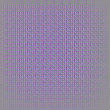

# Keras Convolution Visualization

[](https://travis-ci.org/CyberZHG/keras-conv-vis)
[](https://coveralls.io/github/CyberZHG/keras-conv-vis)


\[[中文](https://github.com/CyberZHG/keras-conv-vis/blob/master/README.zh-CN.md)|[English](https://github.com/CyberZHG/keras-conv-vis/blob/master/README.md)\]

## 安装

```bash
pip install git+https://github.com/cyberzhg/keras-conv-vis
```

## 使用

参考[论文](https://arxiv.org/pdf/1412.6806.pdf)和[样例](./demo/guided_backpropagation.py).

```python
import keras
import numpy as np
from PIL import Image

from keras_conv_vis import replace_relu, get_gradient, Categorical

model = keras.applications.MobileNetV2()
# 将模型中所有的ReLU替换为所需的特殊反向传播
model = replace_relu(model, relu_type='guided')
gradient_model = keras.models.Sequential()
gradient_model.add(model)
# 只让特定的类别传递梯度
gradient_model.add(Categorical(284))  # ImageNet第284类是暹罗猫
# 获取输入的梯度
gradients = get_gradient(gradient_model, inputs)

# 将得到梯度归一化和可视化
gradient = gradients.numpy()[0]
gradient = (gradient - np.min(gradient)) / (np.max(gradient) - np.min(gradient) + 1e-4)
gradient = (gradient * 255.0).astype(np.uint8)
visualization = Image.fromarray(gradient)
```


| Input | Gradient | Deconvnet without Pooling Switches | Guided Backpropagation |
|:-:|:-:|:-:|:-:|
|||||
